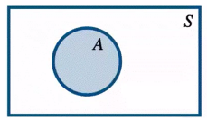

# 25-08

## Plan:
    1. Info om Gruppearbeid.
    2. Repetisjon.
    3. Hendelser og sannsynlighet.

### 1. Gruppearbeid

- Teller 30%.
- Lite FORprojekt om to uker (innk gruppekontrakt).
- 3 til 6 personer i hver gruppe: bruk samme fagkode.
- Blackboard påmelding!

### 2. Repetisjon

**Gjennomsnitt**
- Summen av alle verdier delt på antall verdier.

**Median**
- Verdien som deler et datasett i to like store deler.
- For et oddetall antall verdier: den midterste verdien.
- For et partall antall verdier: gjennomsnittet av de to midterste verdiene.
- Empirisk standardavvik: et mål på spredningen i et datasett.
- Empirisk varians: kvadratet av det empiriske standardavviket.

**Venndiagram**

- Et diagram som viser forholdet mellom forskjellige mengder.
- Brukes til å illustrere union, snitt og forskjell mellom mengder.
- Mye bruk av union og snitt. (I bildet er det A ∩ B; Snittet)
- P(A ∩ B) = P(A) + P(B) når A og B er disjunkte.

**Begreper**
- Kombinatorikk
- Betinget sannsynlighet
- Bayes' regel

### 3. Hendelser og sannsynlighet

- Sannsynlighet for elev tilhører 1002
- Sannsynlighet for elev er ålesund

1. Stokastisk forsøk: Trekker en tilfeldig student fra klassen.
2. Utfallsrom: Alle elever i klassen. ${\{navn_1, navn_2\}}$
3. Hendelser:
    A: student tilhører 1002
    B: student er fra Ålesund

        A E S
        B E S

4. Sannsynlighet for enkeltutfall.

        Eks: Hva er sannsynlighet for at tilfeldig student er modul 1002?

$$P(B) = \frac{n(B)}{n(S)} = \frac{563}{1135} = 0.1$$

        Eks: P(A ∩ B)

$$P(A ∩ B) = \frac{n(A ∩ B)}{n(S)} = \frac{n(A) + n(B) - n(A ∪ B)}{n(S)}$$

        Eks: P(A | B) - betinget sannsynlighet (B har skjedd)

$$P(A | B) = \frac{P(A ∩ B)}{P(B)} = \frac{80}{190} = 0.421$$

        Eks: P(B | A) - betinget sannsynlighet (A har skjedd)

$$P(B | A) = \frac{P(A ∩ B)}{P(A)} = \frac{80}{563} = 0.142$$

Bayes' setning (Bayes' theorem):

$$P(B|A) = \frac{P(A|B) \cdot P(B)}{P(A)}$$

        Eks: er A og B uanhengie?

        P(A|B) ≈ 0.42
        P(B|A) ≈ .142
        P(A) ≈ .50
        P(B) ≈ .17

        P(A ∩ B) ≈ .07
        P(A) * P(B) ≈ .50 * .17 ≈ .085 
        -> Tja ikke helt uavhengige, fordi svaret ikke er likt.