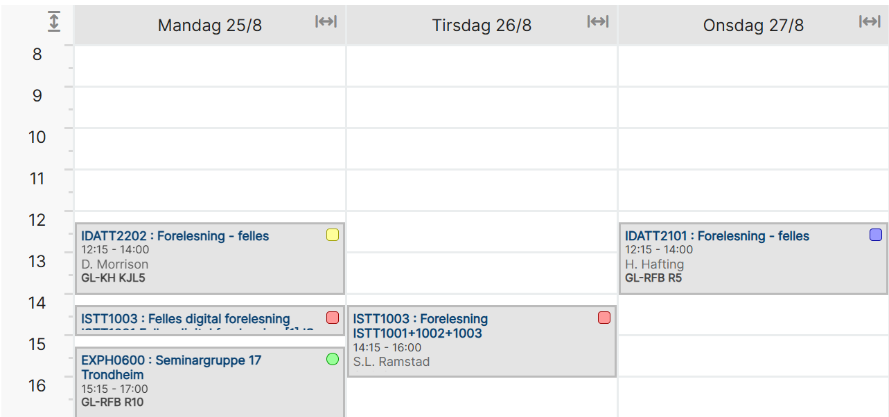

# 2.0

## Aktive Emner
- [**EXPH0600**](./exphil/readme.md) Examen philosophicum for ingeniørfag (7,5 stp.)
- [**IDATT2101**](./algda/readme.md) Algoritmer og datastrukturer (7,5 stp.)
- [**IDATT2202**](./operativ-system/readme.md) Operativsystemer (7,5 stp.)
- [**ISTT1003**](./statistikk/readme.md) Statistikk (7,5 stp.)

## Timeplan (standard uke)

## Fag & Eksamensdatoer
| Dato        | Fag                                | Fagkode   | Type                |
|-------------|------------------------------------|-----------|---------------------|
| 07.11.2025  | Examen philosophicum for ingeniørfag | EXPH0600  | Hjemmeeksamen       |
| 27.11.2025  | Algoritmer og datastrukturer        | IDATT2101 | Skriftlig skoleeksamen |
| 03.12.2025  | Examen philosophicum for ingeniørfag | EXPH0600  | Flervalgseksamen    |
| 09.12.2025  | Examen philosophicum for ingeniørfag | EXPH0600  | Hjemmeeksamen       |
| 10.12.2025  | Operativsystemer                    | IDATT2202 | Skriftlig skoleeksamen |
| 15.12.2025  | Statistikk. Digital skoleeksamen    | ISTT1003  | Digital skoleeksamen |
