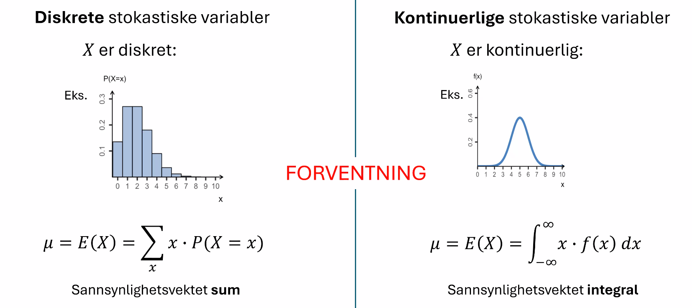

## Spørsmål

Hva representerer liten `x`
        ett tall på talllinjen.

**Hva representerer $\mu$ og `E(x)`?:**

    forventningsverdien til x.

    
Hva representerer $\sigma$ OG SD(x)?:

        standardavviket til x.

Hva er notasjonen for kumulativ sannsynlighet for en stokastisk variabel $X$?

$F(x)$

$P(X \leq x)$

        Vi legger sammen punktsannsynlighetene for alle verdier mindre enn eller lik `x`.

Hva er notasjonen for sannsynlighetstettheten til en kontinuerlig stokastisk variabel $X$?

$f(x)$

    Sannsynlighetstettheten angir hvor tett sannsynligheten er rundt et punkt på tallinjen.

### Eksempler på målinger som modelleres med diskrete stokastiske variabler

- Antall biler som passerer et kryss i løpet av en time
- Antall telefoner som mottas på en kundeservice i løpet av en dag
- Antall feil på en produksjonslinje
- Antall personer som får riktig svar på en quiz

Disse målingene tar kun bestemte, adskilte verdier (heltall).
En stokastisk variabel med en diskre mengde av mulige utfall kalles en **diskret stokastisk variabel**.

